# Setup your REACT Native Environment
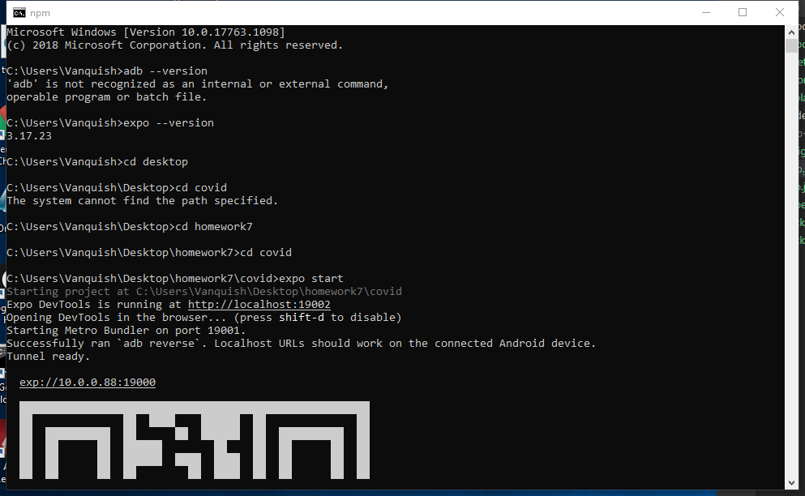 
# Go through REACT native Tutorial
## Results from emulator:
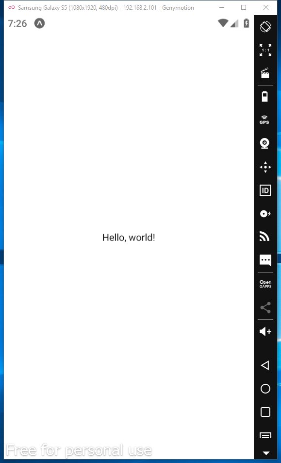 
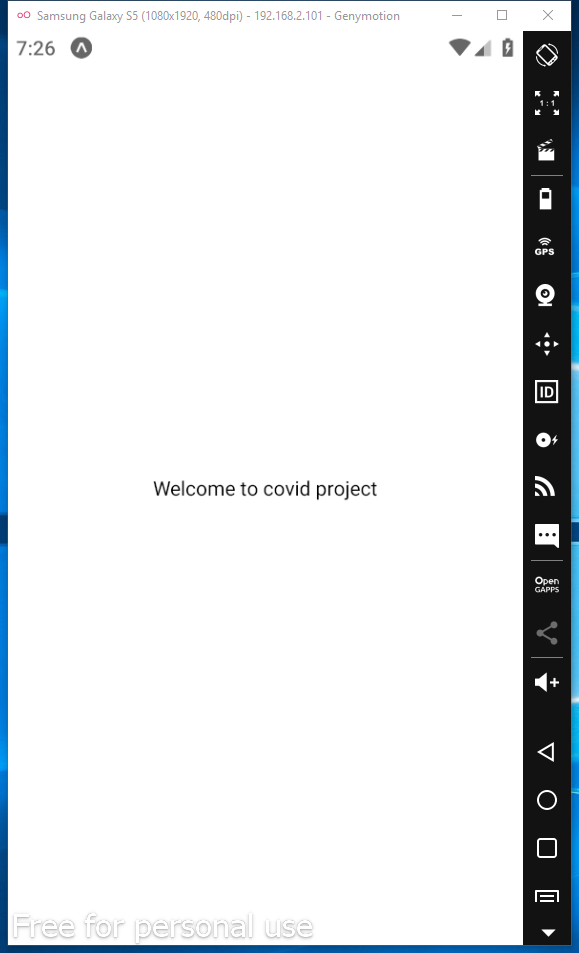 
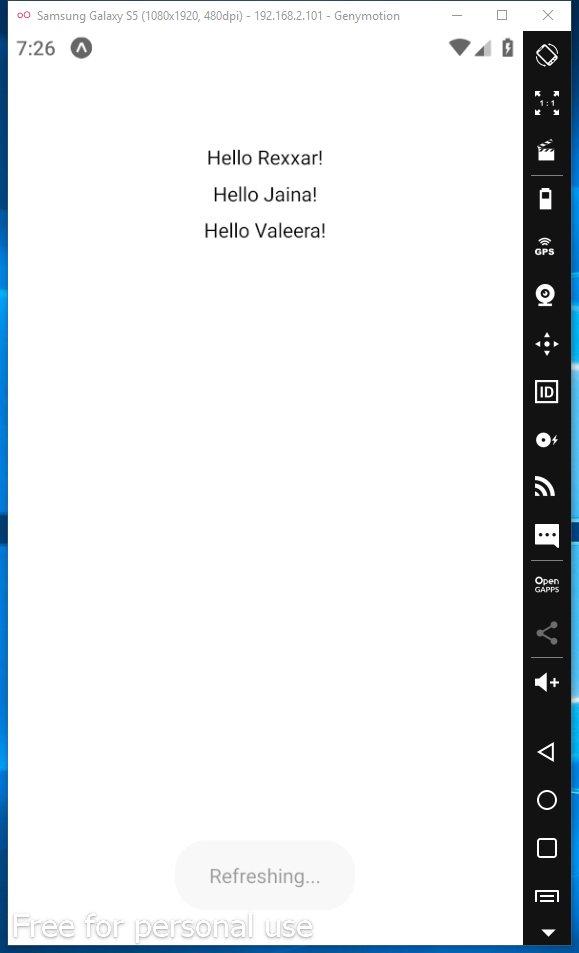 
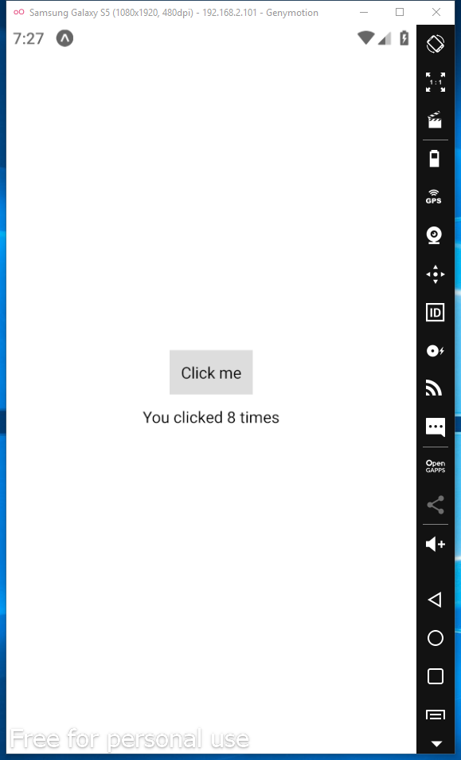 
## Results from the cellphone:
 
 
 
 
# Step 3:  Develop use case to display a map. 
## Result from emulator:
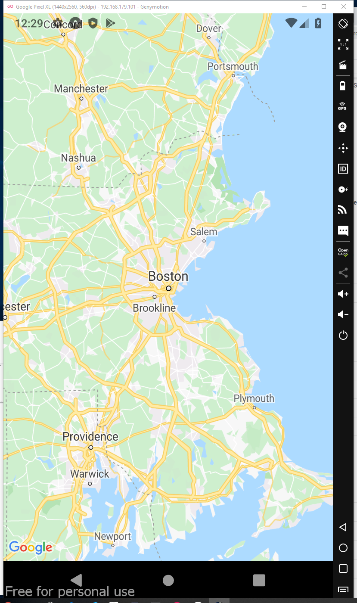 
## Result from the cellphone:
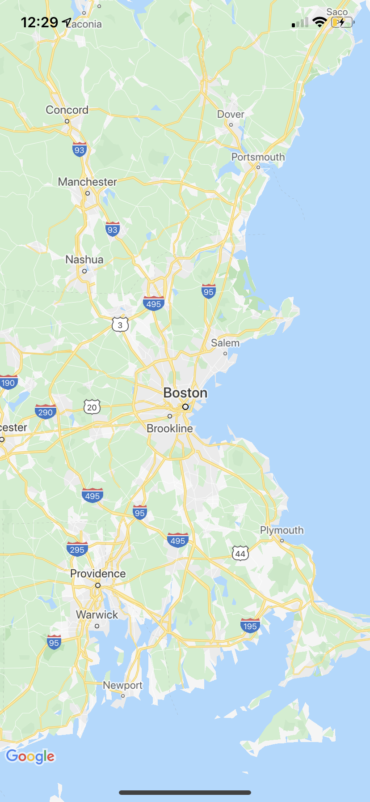 
# Step 4: Covidapi
## Result from emulator:
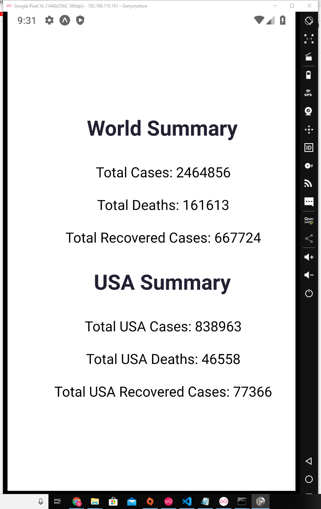 
## Result from the cellphone:
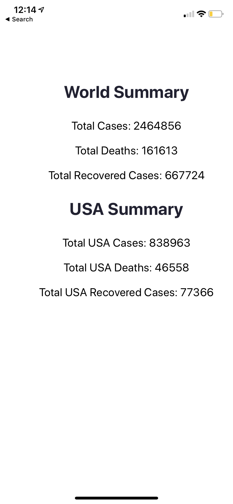 
# Step 6
## Result from emulator:
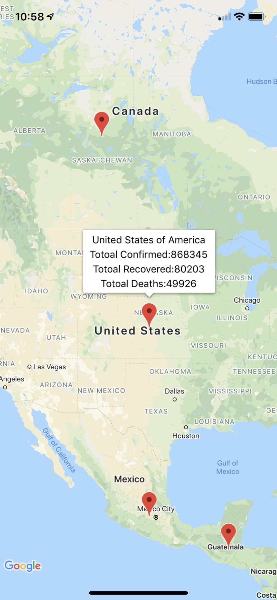 
## Result from the cellphone:
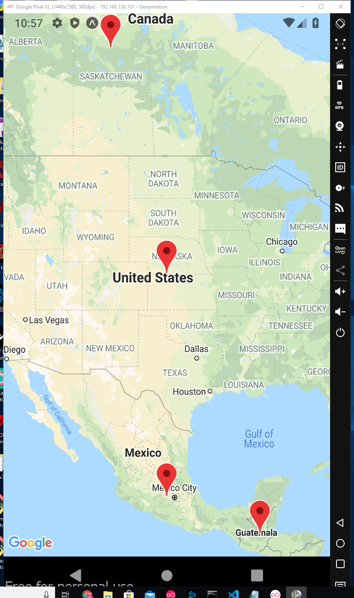 
